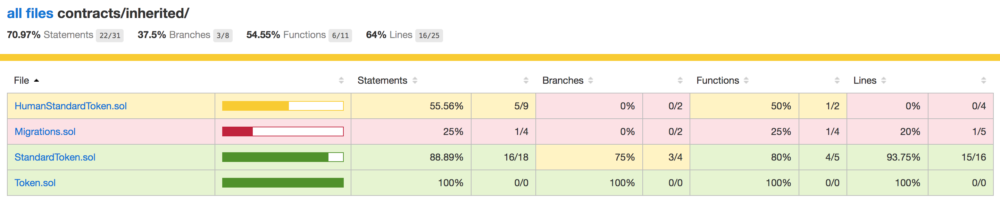
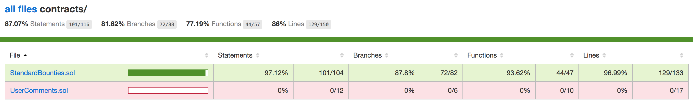

# Code Coverage

Code coverage using the [Solidity-Coverage](https://github.com/sc-forks/solidity-coverage) tool was used to measure the what portions of the codebase was run with the given test suite.

The test coverage results are located in the code coverage directory and can be viewed by opening the `index.html` file or by observing the image below:

Coverage Results Preview:





[Report Directory](../coverage)

## Oyente Report

### StandardBounties.sol

```
======= contract StandardBounties =======
EVM code coverage: 43.5%
Callstack bug: False
Money concurrency bug: True
Time dependency bug: False
Reentrancy bug: False
Assertion failure: False

Money concurrency bug:
Flow 1:
StandardBounties:408:11:
bounties[_bountyId].issuer.transfer(difference)
^
Flow 2:
StandardBounties:387:9:
fulfillments[_bountyId][_fulfillmentId].fulfiller.transfer(bounties[_bountyId].fulfillmentAmount)
^
=========================================
```
